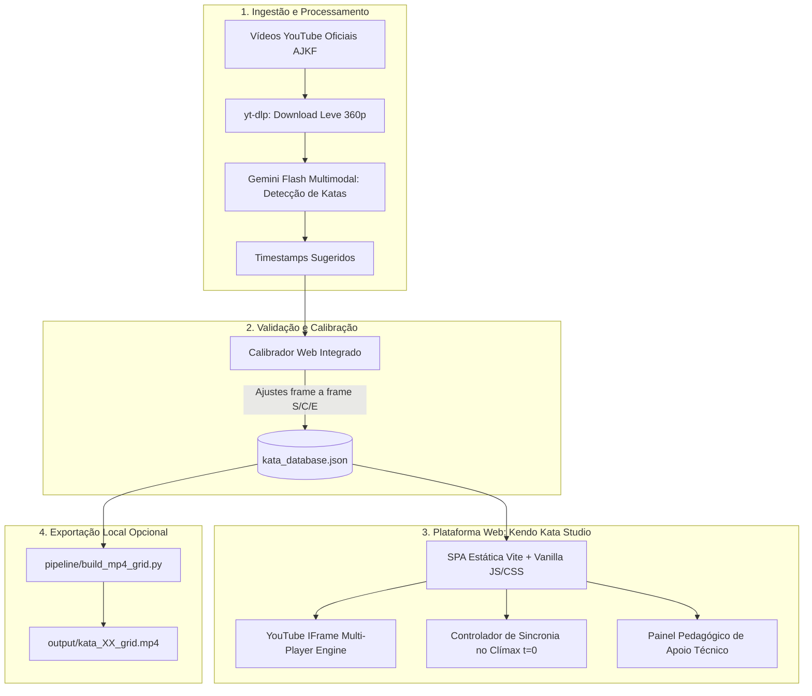

# Especificação Técnica: Kendo Kata Studio & Comparador Multivídeo

**Data:** 2026-09-29  
**Status:** Aprovado para Planejamento de Implementação  
**Autor:** Antigravity & Usuário  

---

## 1. Visão Geral e Objetivos

O **Nihon Kendo Kata Studio** é uma plataforma integrada de estudo técnico de Kendo Kata desenvolvida para permitir a comparação visual e doutrinária precisa de demonstrações de mestres Hanshi 8º Dan da All Japan Kendo Federation (AJKF).

### Objetivos Centrais:
1. **Compartilhamento e Acesso Sem Fricção:** Uma aplicação web (SPA estática) que reproduz diretamente vídeos oficiais do YouTube via YouTube IFrame API, com custo zero de infraestrutura e hospedável gratuitamente em plataformas estáticas (GitHub Pages, Vercel ou Netlify).
2. **Sincronização Pelo Clímax ($t = 0$):** Alinhamento dinâmico no exato momento do impacto do contragolpe de *Shidachi*, eliminando a perda de sincronia causada por cadências diferentes de aproximação entre duplas.
3. **Acervo Inicial Abrangente e Expansível:** Catálogo inicial contemplando 8 a 10 demonstrações oficiais de alta relevância (campeonatos All Japan, torneios de 8º Dan e vídeo padrão AJKF), com suporte a expansão contínua.
4. **Painel Pedagógico Integrado:** Exibição sincronizada dos princípios doutrinários de cada kata (*Kamae*, alvo, técnica de Shidachi, nível de iniciativa *Mitsu no Sen*, critérios de avaliação *chakuganten* e erros comuns).
5. **Calibração Assistida e Exportação Opcional Offline:** Calibrador web milimétrico embutido no app e script auxiliar em Python/FFmpeg para gerar arquivos `.mp4` físicos em matriz 2x2 quando necessário.

---

## 2. Arquitetura do Sistema



---

## 3. Modelo de Dados (`data/kata_database.json`)

O arquivo `data/kata_database.json` é a fonte única de verdade do projeto e possui a seguinte estrutura formal:

```json
{
  "version": "1.0",
  "katas_pedagogical": {
    "kata_01": {
      "id": "kata_01",
      "number": 1,
      "name_jp": "一本目",
      "name_romaji": "Ippon-me",
      "type": "tachi",
      "kamae_uchidachi": "Morote Hidari Jodan",
      "kamae_shidachi": "Morote Migi Jodan",
      "target_uchidachi": "Shomen (linha dos dentes)",
      "waza_shidachi": "Men-nuki-men",
      "sen": "Sen-sen-no-sen (先々の先)",
      "zanshin": "Morote Hidari Jodan com avanço imponente do pé esquerdo",
      "chakuganten": [
        "Uchidachi deve cortar sem puxar a lâmina para trás (sem handō)",
        "Shidachi deve manter o tronco perfeitamente aprumado (shizentai) na esquiva"
      ],
      "common_mistakes": [
        "Perda do alinhamento vertical da coluna de Shidachi ao recuar",
        "Hesitação entre a esquiva e o contra-ataque",
        "Ausência de tensão espiritual (kigurai) contínua no zanshin"
      ]
    }
    // kata_01 a kata_10 (Tachi 1 a 7 e Kodachi 1 a 3)
  },
  "demonstrations": [
    {
      "id": "ajkf_official_standard",
      "title": "Vídeo Padrão de Instrução AJKF",
      "event": "Demonstração Oficial AJKF",
      "year": 2020,
      "youtube_id": "QIpPUdTCv-Y",
      "uchidachi": {
        "name": "Katsunobu Sato",
        "title": "Hanshi 8º Dan",
        "bio": "Ex-instrutor-chefe do Keishicho, árbitro e examinador sênior AJKF"
      },
      "shidachi": {
        "name": "Tanetoshi Terachi",
        "title": "Hanshi 8º Dan",
        "bio": "Mestre do Keishicho, tricampeão mundial por equipes (WKC)"
      },
      "katas": {
        "kata_01": { "start": 83.4, "climax": 96.2, "end": 112.5 },
        "kata_02": { "start": 125.0, "climax": 137.8, "end": 154.2 }
        // ... kata_01 a kata_10
      }
    }
    // 8 a 10 demonstrações oficiais do catálogo
  ]
}
```

---

## 4. Pipeline de Ingestão e Ferramenta de Calibração

### 4.1 Ingestão Automatizada com IA (`pipeline/analyze_enbu.py`)
1. Recebe a URL do YouTube ou ID do vídeo e metadados da dupla.
2. Faz download leve de amostra de vídeo com `yt-dlp` (resolução 360p).
3. Submete o vídeo para a API Gemini Flash com instruções especializadas de Kendo:
   - Identificar início dos 10 katas (*start* = transição a partir de *kyū-ho no ma-ai*);
   - Identificar momento exato do impacto/contragolpe de Shidachi (*climax*);
   - Identificar conclusão do zanshin e retorno aos 9 passos (*end* = estabilização final em *Chūdan*).
4. Produz candidatos de timestamps no JSON.

### 4.2 Calibrador Web Integrado (Interface de Precisão)
1. Permite carregar qualquer vídeo do YouTube pelo navegador.
2. Controles de precisão frame a frame (teclas `J`/`L`, saltos de $\pm 0.1\text{s}$).
3. Teclas de atalho para marcação instantânea:
   - `S`: Grava **Start**
   - `C`: Grava **Clímax**
   - `E`: Grava **End**
4. Botão de teste com visualização contínua do corte.
5. Botão para exportar/baixar o `kata_database.json` atualizado.

---

## 5. Aplicação Web: Kendo Kata Studio

### 5.1 Motor de Sincronização no Clímax (YouTube IFrame API)
* **Linha do Tempo Mestre:** Ancorada em $t=0$ (o clímax do kata).
* **Cálculo de Deslocamento:** Para cada vídeo $i$, o timestamp absoluto é dado por:
  $$T_i(t) = C_i + t$$
* **Barra de Progresso Relativa:** Mostra o tempo transcorrido antes do golpe (ex: $-8.5\text{s}$), o instante do golpe ($0.0\text{s}$) e a fase de zanshin/recuo (ex: $+11.2\text{s}$).
* **Buffer Lock:** Ao navegar ou iniciar reprodução, os players pausam no frame correspondente e aguardam o sinal de prontidão de todos os vídeos ativos antes de dar play síncrono.
* **Áudio:** Controle exclusivo onde apenas um player emite áudio (ou todos em mute), evitando sobreposição de kiais.
* **Controles:**
  - Play/Pause sincronizado;
  - Botão de Instant Replay do Clímax;
  - Saltos de $\pm 1$ segundo;
  - Seletor de velocidade: `0.25x`, `0.5x`, `0.75x`, `1.0x`;
  - Modo Loop contínuo do kata selecionado.

### 5.2 Grade Dinâmica e Painel Didático
* **Layouts de Grade:** Alternância dinâmica entre 1x1 (solo), 1x2 (lado a lado) e 2x2 (4 quadrantes).
* **Seletor de Demonstrações:** Dropdown em cada quadrante para trocar a dupla comparada a qualquer momento.
* **Painel Pedagógico Retrátil:**
  - Informações técnicas: Kamaes, Waza, Alvo, Iniciativa (*Mitsu no Sen*).
  - Pontos Críticos de Avaliação (*Chakuganten* da AJKF).
  - Erros Mais Frequentes e orientações doutrinárias.

### 5.3 Design System e Identidade Visual
* **Paleta Kendo Premium:**
  - Fundo principal: `#0B0F19` (Aizome escuro)
  - Superfícies dos cards e painéis: `#141C2E`
  - Destaques e acentos: `#D4AF37` (Take / Ouro tradicional) e `#E03131` (Vermelho laca)
  - Bordas e divisores: `#222F48`
* **Tipografia:** Google Fonts Inter (alta legibilidade de UI) + Noto Serif JP (Kanji e estética tradicional).

---

## 6. Módulo Opcional de Exportação Offline (`pipeline/build_mp4_grid.py`)

Para cenários onde é necessário levar vídeos físicos ao dojo sem internet:
* Lê os timestamps de `kata_database.json`.
* Baixa os vídeos brutos em 1080p via `yt-dlp` (com cache em `raw_videos/`).
* Aplica corte alinhado pelo clímax (preenchendo início/fim para que o golpe coincida exatamente no mesmo instante em todos os quadrantes).
* Normaliza resolução de cada quadrante (960x540) e taxa de quadros (30fps).
* Aplica legendas com os nomes dos mestres no topo de cada quadrante.
* Monta a matriz 2x2 (1920x1080) com o filtro `xstack` do FFmpeg.
* Salva os arquivos prontos em `output/kata_01_ipponme_grid.mp4` a `kata_10_kodachi_sanbonme_grid.mp4`.

---

## 7. Estratégia de Testes e Validação

1. **Validação do Modelo de Dados:** Testes automatizados para validar que `kata_database.json` segue estritamente o schema, com todos os IDs válidos, timestamps crescentes ($S < C < E$) e dados pedagógicos completos para os 10 katas.
2. **Validação do Motor de Sincronia Web:** Verificação com subagente de browser garantindo que os players carregam, pausam, sincronizam a linha do tempo relativa e reagem aos comandos de velocidade e loop.
3. **Validação da Ferramenta de Calibração:** Teste dos atalhos de teclado (`S`, `C`, `E`) e geração correta do JSON exportado.
4. **Validação do Script FFmpeg:** Teste de renderização de 1 kata demonstrativo para verificar alinhamento e qualidade do arquivo `.mp4` gerado.
